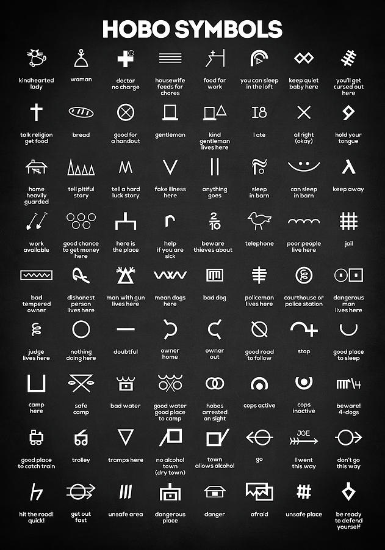

<h3 align="center">Hobocons</h3>

<p align="center">
  Open source SVG icon library of hobo symbols based on Bootstrap icons.
  <br>
  <a href="https://icons.getbootstrap.com/"><strong>Explore Bootstrap Icons »</strong></a>
  <br>
  <br>
  <a href="https://getbootstrap.com/">Bootstrap</a>
  ·
  <a href="https://themes.getbootstrap.com/">Themes</a>
  ·
  <a href="https://blog.getbootstrap.com/">Blog</a>
  <br>
</p>

[](https://icons.getbootstrap.com)

## Install

Bootstrap Icons are packaged up and published to npm. We only include the processed SVGs in this package—it's up to you and your team to implement. [Read our docs](https://icons.getbootstrap.com/) for usage instructions.

```shell
npm i bootstrap-icons
```

[Also available in Figma.](https://www.figma.com/community/file/972989644486753519/Bootstrap-Icons-v1.5.0)

## Usage

Depending on your setup, you can include Bootstrap Icons in a handful of ways.

- Copy-paste SVGs as embedded HTML
- Reference via `` element
- Use the SVG sprite
- Include via CSS

[See the docs for more information.](https://icons.getbootstrap.com/#usage)

## Development

[](https://github.com/twbs/icons/actions?workflow=Tests)

Clone the repo, install dependencies, and start the Hugo server locally.

```shell
git clone https://github.com/twbs/icons/
cd icons
npm i
npm start
```

Then open `http://localhost:4000` in your browser.

### npm scripts

Here are some key scripts you'll use during development. Be sure to look to our `package.json` for a complete list of scripts.

| Script | Description |
| --- | --- |
| `start` | Alias for running `docs-serve` |
| `docs-serve` | Starts a local Hugo server |
| `pages` | Generates permalink pages for each icon with template Markdown |
| `icons` | Processes and optimizes SVGs in `icons` directory |

## Adding SVGs

Icons are typically only added by @mdo, but exceptions can be made. New glyphs are designed in Figma first on a 16x16px grid, then exported as flattened SVGs with `fill` (no stroke). Once a new SVG icon has been added to the `icons` directory, we use an npm script to:

1. Optimize our SVGs with SVGO.
2. Modify the SVGs source HTML, removing all attributes before setting new attributes and values in our preferred order.

Use `npm run icons` to run the script, run `npm run pages` to build permalink pages, complete those pages, and, finally, commit the results in a new branch for updating.

## Publishing

Documentation is published automatically when a new Git tag is published. See our [GitHub Actions](https://github.com/twbs/icons/tree/main/.github/workflows) and [`package.json`](https://github.com/twbs/icons/blob/main/package.json) for more information.

## License

MIT

## Author

[@mdo](https://github.com/mdo)
